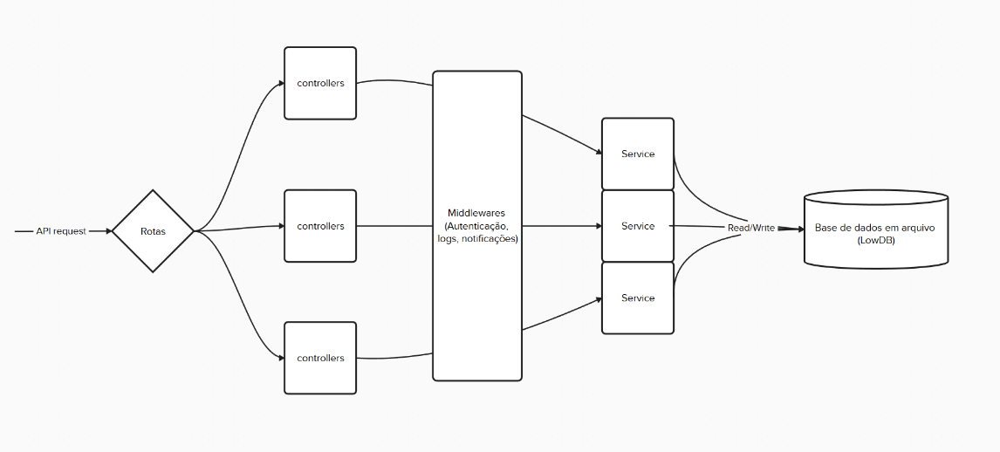

## Visão geral da arquitetura:

Quando reunimos os requisitos e pensamos em possibilidades de resolução do problema do trabalho, inicialmente imaginamos criar a API usando o modelo MVC, por ser simples e fácil de entender, além de altamente utilizado em projetos reais e ter muitas fontes de informação e exemplos confiáveis.

No entanto, de acordo com a evolução do projeto, o grupo notou que seria interessante diminuir a complexidade removendo a view, visto que os requisitos/critérios avaliativos levavam em consideração apenas o funcionamento das chamadas da API, e nenhum conceito de navegabilidade ou visual. Tendo feito esta decisão decidimos também diminuir as responsabilidades do Model, visto que, usando um banco de dados baseado em arquivos, não seria necessário instanciar objetos de tarefa e usuário no código, já que devido a natureza simples da API poderiamos fazer essa leitura em tempo real sem causar problemas de demora.

Tendo essas ideias em vista, imaginamos que não estávamos mais implementando o MVC tradicional então pesquisamos alternativas para as nossas ideias. Um dos colegas da equipe sugeriu usar um modelo de Controller Service Repository, mais usado com spring mas se aplicava perfeitamente para nós, então decidimos fazer algo semelhante. 
- Criamos os **Controllers** para receberem as chamadas da API através de rotas definidas em outros arquivos `/routes` facilitando manutenção e evitando necessidade de modificar os controllers caso quiséssemos fazer mudanças de rotas
- Criamos a camada de **Service**, que contém funções utilizadas para fazer a inserção, modificação e deleção de itens no banco de dados, desse modo o controller não precisa saber que o banco de dados existe, isolando a interface dos controllers da camada de dados.
- A partir disso criamos **Middlewares** para fazer algumas operações durante a comunicação do controller e do service, criando logs, enviando notificações e fazendo autenticações.
- Além disso criar uma separação entre os controllers e o service nós conseguimos usar estratégias de mock nos testes para evitar que alterações fossem feitas na estrutura de dados real em tempo de teste.

Dessa forma, o código ficou mais simples de entender, mais modular de forma que evitasse *double maintenance*, facilitando debug e permitindo extensão caso necessário. Para adicionar uma view basta fazermos chamadas para os controllers, sem ter a necessidade de comunicar o front com o banco de dados. Para adicionar uma nova rota, basta criar um novo router ou modificar um existente e adicionar a função no controller, usando services para abstrair a leitura e escrita no banco.

## Testes: Tecnologias escolhidas e motivação

- **Tecnologias:**
  - [Jest](https://jestjs.io/) para execução dos testes automatizados.
  - [Supertest](https://github.com/ladjs/supertest) para simular requisições HTTP aos endpoints.
- **Por que essas escolhas?**
  - Jest é simples, rápido e amplamente utilizado na comunidade Node.js.
  - Supertest permite testar a API de ponta a ponta, simulando o uso real.
  - O isolamento do banco garante testes confiáveis e reprodutíveis.


## Logs: Tecnologias escolhidas e motivação:

- **Tecnologia:** [Winston](https://github.com/winstonjs/winston)
- **Como usamos:**
  - Todos os eventos importantes (criação, erro, autenticação, etc) são registrados via middleware
  - Os logs são gravados tanto em arquivo (na pasta `logs/`) quanto no console, com timestamp e contexto, criando um output rápido e um registro permanente.
  - O sistema diferencia logs de produção e de testes, criando arquivos separados, unificando por execuções.
- **Por que essa escolha?**
  - Winston é robusto, flexível e permite direcionar logs para lugares diferentes
  - Facilita auditoria, debugging e monitoramento do sistema.

## Webhooks: Integração com Discord

- **Tecnologias:** [Axios](https://axios-http.com/) para requisições HTTP, integração via Webhook do Discord.
- **Como funciona:**
  - Ao criar ou atualizar tarefas, enviamos uma notificação automaticamente para um canal do Discord via webhook.
  - O endpoint do webhook é configurado por variável de ambiente (.env) (`DISCORD_WEBHOOK_URL`).
- **Por que essa escolha?**
  - Webhooks são simples, rápidos e não exigem dependências pesadas.

## Express e Estrutura dos Endpoints

- **Tecnologia:** [Express](https://expressjs.com/)
- **Como os endpoints estão estruturados:**
  - As rotas estão separadas por domínio (`/users`, `/tasks`, `/auth`), cada uma em seu arquivo na pasta `routes/`.
  - Cada rota chama um controller responsável por tratar a requisição e passar para o service.
  - Middlewares são usados para autenticação (JWT), logs e notificações.
  - A documentação dos endpoints é feita via Swagger/OpenAPI, disponível em `localhost:5000/api-docs` ao subir a aplicação.
- **Por que essa escolha?**
  - Express é leve, flexível e tem grande adoção na comunidade.
  - A separação por rotas/controllers facilita a manutenção e a escalabilidade.
  - Swagger permite documentação interativa e simples.

## Persistência de Dados: LowDB e Service

- **Tecnologia:** [LowDB](https://github.com/typicode/lowdb)
- **Como é usado:**
  - O arquivo `db.js` inicializa o banco de dados JSON, com validação de estrutura e isolamento para testes.
  - Os services (`userService.js`, `taskService.js`, etc.) fazem toda a leitura e escrita no banco via métodos async (`db.read()`, `db.write()`).
  - O banco pode ser facilmente trocado por outro (ex: MongoDB) sem grandes mudanças na lógica dos services/controllers.
- **Por que essa escolha?**
  - LowDB é simples, não exige servidor externo e é ideal para MVPs e projetos de pequeno porte.
  - Permite prototipação rápida e fácil entendimento do fluxo de dados.

## Diagrama do projeto:



## Modelo de Dados

### Usuário
```json
{
  "id": "uuid",
  "username": "string",
  "age": "number",
  "email": "string"
}
```

### Tarefa
```json
{
  "id": "uuid",
  "title": "string",
  "status": "string",
  "assignee": "user_id",
  "descricao": "string",
  "prioridade": "baixa|normal|alta",
  "deadline": "date|null"
}
```